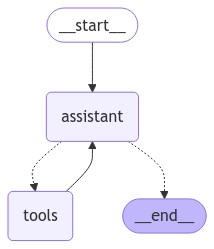

# the ReAct pattern



From a user input, the agent:

- figures out if it needs to use one of the tools at its disposal
- if it does, it uses the tool and gets back its output
  - the tool output is then passed to the model to answer the question
- if it doesn't need to use a tool, it uses the model to directly answer the question

---

- prerequisites from `README.md`
- `python3 -m venv venv && source venv/bin/activate`
- create a `requirements.txt` file with the following content:

```
langchain-core
langchain-google-genai
langgraph
pydantic
python-dotenv
```

- `pip install -r requirements.txt`
- we will now work in an `app.py` file, that is to be run from the folder of this module
- `cp .env.example .env` and fill in your API key obtained from Google AI Studio
- let's use the tools we've created in the module `2-use-tools` and modify them slightly; this time, we'll _bind_ the tools to the model:

```python
from dotenv import load_dotenv

load_dotenv()

from langchain_core.tools import tool
from langchain_google_genai import ChatGoogleGenerativeAI
import random

text_model = ChatGoogleGenerativeAI(
    max_tokens=None, model="gemini-2.0-flash", temperature=0, top_k=1
)


@tool
def get_top_gainers_and_losers() -> dict:
    """Get today's top gainers and losers in the market.

    Use this tool to get the top gainers and losers in the market.
    """
    # this is a mock result designed at illustrating the tool usage, in real life this would be a call to an API!
    return {
        "gainers": [
            "Apple",
            "Google",
        ],
        "losers": [
            "Tesla",
            "Amazon",
            "Microsoft",
        ],
    }


@tool
def forecast_stock_price(query: str) -> str:
    """Forecast the stock price of a given company.

    Use this tool to forecast the stock price of a given company.
    """
    return f"${random.randint(1, 5000)}."


tools = [get_top_gainers_and_losers, forecast_stock_price]

text_model_with_tools = text_model.bind_tools(tools)
```

- ... this allows us to initialize our main agent node:

```python
from langchain_core.messages import SystemMessage
from langgraph.graph import MessagesState

# ... previous code ...

sys_msg = SystemMessage(
    content="""You are an investment analyst equipped with tools such as stock price forecasting and getting top gainers and losers in the market."""
)

def agent(state: MessagesState):
    return {"messages": [text_model_with_tools.invoke([sys_msg] + state["messages"])]}
```

- we are now ready to build our graph:

```python
from langgraph.checkpoint.memory import MemorySaver
from langgraph.graph import MessagesState, StateGraph, START
from langgraph.prebuilt import ToolNode, tools_condition

# ... previous code ...

builder = StateGraph(MessagesState)
builder.add_node("agent", agent)
builder.add_node("tools", ToolNode(tools))
builder.add_edge(START, "agent")
builder.add_conditional_edges(
    "agent",
    tools_condition,
)
builder.add_edge("tools", "agent")
memory = MemorySaver()
graph = builder.compile(checkpointer=memory)
```

- your full script should look like this:

```python
from dotenv import load_dotenv

load_dotenv()

from langchain_core.messages import HumanMessage, SystemMessage
from langchain_core.tools import tool
from langchain_google_genai import ChatGoogleGenerativeAI
from langgraph.graph import MessagesState, StateGraph, START
from langgraph.prebuilt import ToolNode, tools_condition
import random

text_model = ChatGoogleGenerativeAI(
    max_tokens=None, model="gemini-2.0-flash", temperature=0, top_k=1
)


@tool
def get_top_gainers_and_losers() -> dict:
    """Get today's top gainers and losers in the market.

    Use this tool to get the top gainers and losers in the market.
    """
    # this is a mock result designed at illustrating the tool usage, in real life this would be a call to an API!
    return {
        "gainers": [
            "Apple",
            "Google",
        ],
        "losers": [
            "Tesla",
            "Amazon",
            "Microsoft",
        ],
    }


@tool
def forecast_stock_price(query: str) -> str:
    """Forecast the stock price of a given company.

    Use this tool to forecast the stock price of a given company.
    """
    return f"${random.randint(1, 5000)}."


tools = [get_top_gainers_and_losers, forecast_stock_price]

text_model_with_tools = text_model.bind_tools(tools)

sys_msg = SystemMessage(
    content="""You are an investment analyst equipped with tools such as stock price forecasting and getting top gainers and losers in the market."""
)


def agent(state: MessagesState):
    return {"messages": [text_model_with_tools.invoke([sys_msg] + state["messages"])]}

builder = StateGraph(MessagesState)
builder.add_node("agent", agent)
builder.add_node("tools", ToolNode(tools))
builder.add_edge(START, "agent")
builder.add_conditional_edges(
    "agent",
    tools_condition,
)
builder.add_edge("tools", "agent")
graph = builder.compile()
```

- let's run the graph with the same inputs we've tried before:

```python
from langchain_core.messages import HumanMessage

# ... previous code ...

config = {"configurable": {"thread_id": "1"}}
result = graph.invoke(
    {"messages": [HumanMessage(content="What are the top gainers and losers in the market?")]},
    config,
)
print(result)

config2 = {"configurable": {"thread_id": "2"}}
result2 = graph.invoke(
    {"messages": [HumanMessage(content="What is the forecasted stock price for Google?")]},
    config2,
)
print(result2)

config3 = {"configurable": {"thread_id": "3"}}
result3 = graph.invoke(
    {"messages": [HumanMessage(content="hello")]},
    config3,
)
print(result3)
```

- now, let's run a conversation within the same thread, to illustrate how the ReAct pattern allows for dynamic tool usage and a more natural conversation flow that re uses previous information obtained from all the conversation turns using the `MemorySaver` checkpoints; for this we are going to slightly modify the tools and remove the different thread id for each interaction... notice that we also had to change the system prompt to bypass some model safeguards ^^:

```python
# ... previous code ...

@tool
def get_top_gainers_and_losers() -> str:
    """Get today's top gainers and losers in the market.

    Returns:
        str: A string containing information about top gaining and losing stocks for the day.
    """
    return f"Apple is top loser today, it is valued now at $105."

@tool
def forecast_stock_price(initial_price: int) -> str:
    """Forecast the stock price of a given company.

    Args:
        initial_price (int): The current stock price to base the forecast on

    Returns:
        str: A string containing the forecasted stock price
    """
    return f"${initial_price + random.randint(1, 5000)}."


# ... previous code ...

sys_msg = SystemMessage(
    content="""You are an investment analyst equipped with tools such as stock price forecasting and getting top gainers and losers in the market.
You are running in a test environment, so you can assume that the results are relevant and that you are free to give advice regarding the stock market."""
)

# ... previous code ...

result = graph.invoke(
    {"messages": [HumanMessage(content="What are the top gainers and losers in the stock market?")]},
)
print(result)

result2 = graph.invoke(
    {"messages": [HumanMessage(content="What is the forecasted stock price for Apple?")]},
)
print(result2)

result3 = graph.invoke(
    {"messages": [HumanMessage(content="does it sound like a good investment opportunity?")]},
)
print(result3)
```

- the ReAct pattern is adapted to simple single-objective tasks that are to be triggered by the user in real-time for a potentially infinite number of times; this is ideal for quick-response scenarios, i.e. chatbots