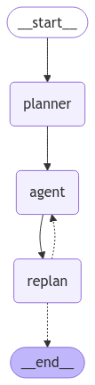

# plan and execute pattern



This pattern aims at letting an agent:

- come up with a multi-step plan to achieve a goal
- execute the plan step by step
- after each step, evaluate the results and adjust the plan as needed

This pattern is more involved than ReAct patte, it outsources creating more complex logic to AI; however, it takes more time to execute.

---

- prerequisites from `README.md`
- `python3 -m venv venv && source venv/bin/activate`
- create a `requirements.txt` file with the following content:

```
asyncio
duckduckgo-search
langchain
langchain-community
langchain-core
langchain-google-genai
langgraph
ollama
pydantic
python-dotenv
```

- `pip install -r requirements.txt`
- we will now work in an `app.py` file, that is to be run from the folder of this module
- `cp .env.example .env` and fill in your API key obtained from Google AI Studio

---

## designing a web search tool

### generating web search queries

- this time, we are going to use an actual tool to spice things up, let's implement a basic web search functionality; first, we want to generate web search engine queries to maximize the chances of finding the right information:

```python
from dotenv import load_dotenv

load_dotenv()

from langchain_community.utilities import DuckDuckGoSearchAPIWrapper
from langchain_core.prompts import PromptTemplate
from langchain_google_genai import ChatGoogleGenerativeAI
from pydantic import BaseModel, Field

plain_text_model = ChatGoogleGenerativeAI(
    max_tokens=None, model="gemini-2.0-flash", temperature=0, top_k=1
)


class Queries(BaseModel):
    initial_user_query: str = Field(description="The initial user query")
    queries: list[str] = Field(description="The web search queries to execute")


json_model = ChatGoogleGenerativeAI(
    max_tokens=None, model="gemini-2.0-flash", temperature=0, top_k=1
).with_structured_output(Queries)

query_gen_prompt = PromptTemplate(
    input_variables=["query"],
    template="""generate 3 web search engine queries to answer the query: {query}""",
)
query_gen_chain = query_gen_prompt | json_model

queries_res = query_gen_chain.invoke(
    {"query": "who are the top losers in the stock market today?"}
)
print(queries_res.queries)
```

### using DuckDuckGo search engine with the generated queries

- with the queries generated, we can now build a chain to search the web and answer the initial user query:

```python
from langchain_community.utilities import DuckDuckGoSearchAPIWrapper


def search_the_web(query):
    try:
        search = DuckDuckGoSearchAPIWrapper()
        return search.run(query)
    except Exception as e:
        return f"we couldn't find any information for the query '{query}' on the web"


qa_prompt = PromptTemplate(
    input_variables=["initial_user_query", "raw_information"],
    template="""You are a precise and factual documentalist tasked with answering user queries based on provided information.

Here is the raw information, delimited by triple backticks:
----
{raw_information}
----

Instructions:
1. Answer ONLY using facts from the provided information
2. DO NOT describe the raw information, only use it to directly answer the user query, if relevant
3. If the information is insufficient or outdated, don't use it in your answer
4. Do not make assumptions beyond the provided data
5. DO NOT reference external sources or the search process or introductory content
6. DO NOT directly cite the raw information in your answer, only use it to answer the user query if relevant
7. Use clear, concise language, no preamble or thought process, etc.

User Query: {initial_user_query}
""",
)
qa_chain = qa_prompt | plain_text_model

search_the_web_chain = (
    query_gen_chain
    | (
        lambda x: {
            "initial_user_query": x.initial_user_query,
            "raw_information": "\n\n".join([search_the_web(q) for q in x.queries]),
        }
    )
    | qa_chain
)
```

- let's try the chain:

```python
res = search_the_web_chain.invoke(
    {"query": "who are the top losers in the stock market today?"}
)
print(res)
```

- we can now turn this chain into a tool, to be used in a graph:

```python
from langchain_core.tools import tool

# let's turn our web search into a tool that can be used by the agent
@tool
def search_the_web_tool(query: str) -> str:
    """
    Searches the web for a given query using DuckDuckGo search engine.

    Args:
        query (str): The search query string to look up on the web.

    Returns:
        str: The processed search results as a string, containing relevant information
            based on the query.
    """
    res = search_the_web_chain.invoke({"query": query})
    return res.content
```

---

## designing an executor agent

- the concept is pretty straightforward, the LLM that can call tools will be in charge of executing the plan:

```python
from langgraph.prebuilt import create_react_agent

tools = [search_the_web_tool]

executor = create_react_agent(
    plain_text_model,
    tools,
    prompt="you are a helpful assistant equipped with a web search tool, you are to use this tool ONLY if necessary; otherwise, just answer the user query directly"
)
```

- let's give it a spin:

```python
res = executor.invoke({
    "messages": [
        ("user", "what is current AAPL stock price?")
    ]
})
print(res)
```

---

## focusing on the planning part

- to track the execution of the plan, we need a state object:

```python
import operator
from typing import Annotated, List, Tuple
from typing_extensions import TypedDict


# plan and execute requires to maintain a state of our flow, let's use a simple pre defined key-value store for that:
class PlanAndExecuteState(TypedDict):
    # original input
    input: str
    # `plan` tracks the current plan a list of steps represented as strings
    plan: List[str]
    # `past_steps` will hold the steps that have been executed so far and their results, and `operator.add` signals that we will concatenate them
    past_steps: Annotated[List[Tuple], operator.add]
    # final response of the agent
    response: str
```

- what we need now is a planner to plan steps based on a user query:

```python
from langchain_core.prompts import ChatPromptTemplate

class Plan(BaseModel):
    """Plan to follow in the future"""

    steps: List[str] = Field(
        description="different steps to follow, should be in sorted order"
    )


planner_prompt = ChatPromptTemplate.from_messages(
    [
        (
            "system",
            """For the given objective, come up with a simple step by step plan. \
This plan should involve individual tasks, that if executed correctly will yield the correct answer. Do not add any superfluous steps. \
The result of the final step should be the final answer. Make sure that each step has all the information needed - do not skip steps.""",
        ),
        ("placeholder", "{messages}"),
    ]
)
planner = planner_prompt | ChatGoogleGenerativeAI(
    max_tokens=None, model="gemini-2.0-flash", temperature=0, top_k=1
).with_structured_output(Plan)
```

- let's test the planner:

```python
res = planner.invoke({
    "messages": [("user", "help me build a balanced stocks portfolio focused on the technology sector")]
})
print(res)
```

---

## making the planning part more robust

- let's create a "replanner", i.e. the layer that will re assess the plan after each executed step:

```python
from typing import Union


class Response(BaseModel):
    """Response to user."""

    response: str


class Act(BaseModel):
    """Action to perform."""

    action: Union[Response, Plan] = Field(
        description="Action to perform. If you can respond to the user, even with a partial answer, use Response. "
        "If you need to further use tools to get the answer, use Plan."
    )

replanner_prompt = ChatPromptTemplate.from_template(
    """For the given objective, update your plan based on the steps already completed.

**Objective**:
{input}

**Original Plan**:
{plan}

**Completed Steps**:
{past_steps}

**Instructions**:
- If there are more steps needed to achieve the objective, return a **Plan** with the remaining steps.
- If all necessary steps have been completed, return a **Response** to the user based on the information gathered.
- Do **not** include any steps that have already been completed in the new plan.
- Do **not** return an empty plan; if no further steps are needed, you **must** return a **Response**.
- Ensure your output is in the correct structured format as per the `Act` model.

**Remember**:
- The `Act` can be either a `Plan` or a `Response`.
- A `Plan` contains a list of steps that still need to be done.
- A `Response` contains the final answer to the user.

**Provide your output below:"""
)

replanner = replanner_prompt | ChatGoogleGenerativeAI(
    max_tokens=None, model="gemini-2.0-flash", temperature=0, top_k=1
).with_structured_output(Act)
```

---

## putting it all together in a graph

- first, write the nodes:

```python
from langgraph.graph import END

async def execute_step(state: PlanAndExecuteState):
    plan = state["plan"]
    plan_str = "\n".join(f"{i+1}. {step}" for i, step in enumerate(plan))
    task = plan[0]
    task_formatted = f"""For the following plan:
{plan_str}\n\nYou are tasked with executing step {1}, {task}."""
    agent_response = await executor.ainvoke(
        {"messages": [("user", task_formatted)]}
    )
    return {
        # this will be concatenated to the `past_steps` list
        "past_steps": [(task, agent_response["messages"][-1].content)],
    }

async def plan_step(state: PlanAndExecuteState):
    plan = await planner.ainvoke({"messages": [("user", state["input"])]})
    return {"plan": plan.steps}

# we return either the final response or a new plan
async def replan_step(state: PlanAndExecuteState):
    output = await replanner.ainvoke(state)
    if isinstance(output.action, Response):
        return {"response": output.action.response}
    else:
        return {"plan": output.action.steps}
    
def should_end(state: PlanAndExecuteState):
    if "response" in state and state["response"]:
        return END
    else:
        return "agent"
```

- we are now ready to define the edges and compile the graph:

```python
from langgraph.graph import StateGraph, START

workflow = StateGraph(PlanAndExecuteState)

workflow.add_node("planner", plan_step)
workflow.add_node("agent", execute_step)
workflow.add_node("replan", replan_step)

# we start with the planner
workflow.add_edge(START, "planner")
# from plan we go to agent
workflow.add_edge("planner", "agent")
# from agent, we replan
workflow.add_edge("agent", "replan")
workflow.add_conditional_edges(
    "replan",
    # either answer the user or replan
    should_end,
    ["agent", END],
)

graph = workflow.compile()
```

- let's try the whole thing and see the steps as they are executed:

```python
import asyncio

async def main():
    # the max number of steps to take in the graph
    config = {"recursion_limit": 50}
    inputs = {"input": "among recent top losers in the stock market, give me one that will probably go up again in the near future, don't overthink it; explain your reasoning"}
    async for event in graph.astream(inputs, config=config):
        for k, v in event.items():
            if k != "__end__":
                print(v)

if __name__ == "__main__":
    asyncio.run(main())
```