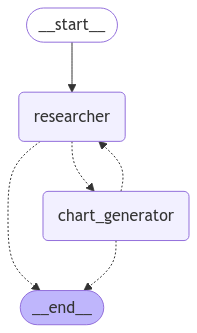
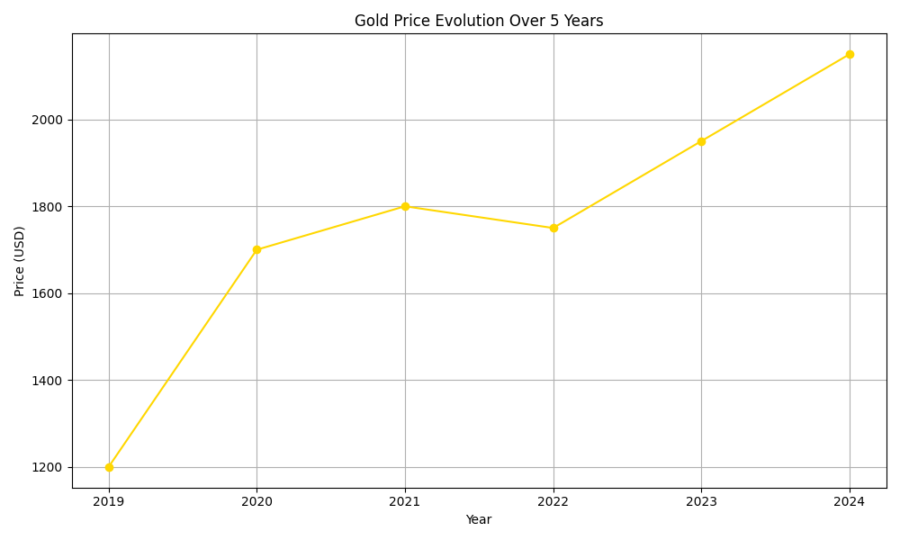

# multi-agent systems

A multi agent application is one that involves multiple independent actors powered by language models connected in a specific way.

Multi agent can, for instance, be a benefitial pattern when:

- your tool calling LLM has too many tools to select from, so you'd want to split these tools in dedicated agents
- evaluating the efficieny of each layer of your graph application is too complex, so you'd want to split these layers in dedicated agents that can be more easily monitored and updated atomically
- you have trouble thinking of your system as a whole because it's becoming too complex, so you'd want to break it down into more manageable units of work

## focus on a multi agent collaboration example



Multi agent collaboration works by allowing different agents to share a scratchpad of messages, this means that the work of each agent is visible to the other agents.

In this example, we will use a researcher agent, that makes web searches and finds information, and a chart generator agent, that uses the information found by the researcher to generate a chart.

---

## writing the tools that our agents will use

- prerequisites from `README.md`
- `python3 -m venv venv && source venv/bin/activate`
- create a `requirements.txt` file with the following content:

```
asyncio
langchain-core
langchain-experimental
langchain-google-genai
langgraph
matplotlib
python-dotenv
```

- `pip install -r requirements.txt`
- we will now work in an `app.py` file, that is to be run from the folder of this module
- `cp .env.example .env` and fill in your API key obtained from Google AI Studio

### web search tool

- to implement the web search tool, we will use the `google.genai` library so we can leverage native Google search capabilities:

```python
from dotenv import load_dotenv

load_dotenv()

from google import genai
from google.genai.types import GenerateContentConfig, GoogleSearch, Tool
from langchain_core.tools import tool


@tool
def search_the_web_tool(query: str) -> str:
    """
    Searches the web for a given query using DuckDuckGo search engine.

    Args:
        query (str): The search query string to look up on the web.

    Returns:
        str: The processed search results as a string, containing relevant information
            based on the query.
    """
    client = genai.Client()
    google_search_tool = Tool(google_search=GoogleSearch())
    response = client.models.generate_content(
        model="gemini-2.0-flash",
        contents=query,
        config=GenerateContentConfig(
            tools=[google_search_tool], response_modalities=["TEXT"]
        ),
    )
    return response.text
```

- let's test the tool:

```python
test = search_the_web_tool(
    "what are the top 10 companies in the world and their market cap?"
)
print(test)
```

### chart generator tool

- let's implement the chart generator tool, using LangChain's REPL tool; be aware that this runs code on your machine, so it should be properly sandboxed:

```python
from langchain_experimental.utilities import PythonREPL
from typing import Annotated

@tool
def matplotlib_tool(
    code: Annotated[str, "The python code to execute to generate your chart."],
):
    """Use this to execute matplotlib code and save the chart as a PNG file.
    The code must use matplotlib to generate a chart."""
    try:
        # Execute the code in a context that ensures proper chart handling
        import matplotlib.pyplot as plt
        import uuid

        # Run the provided code
        exec(code)

        # Generate unique filename
        filename = f"chart_{uuid.uuid4()}.png"

        # Save the current figure
        plt.savefig(filename)
        plt.close()  # Clean up the figure

        result_str = f"Chart saved as: {filename}"
    except BaseException as e:
        return f"Failed to execute. Error: {repr(e)}"

    return (
        result_str + "\n\nIf you have completed all tasks, respond with FINAL ANSWER."
    )
```

... this executes `matplotlib` code so that you can generate a chart, and save it as a PNG file.

- let's test the tool:

```python
print(matplotlib_tool.invoke("import matplotlib.pyplot as plt; plt.plot([1, 2, 3, 4]);"))
```

... there should be a `chart_<uuid>.png` file in the folder.

---

## writing the nodes of our graph

- our researcher agent and our chart generator agent will use the same base system prompt, so we can define it once and reuse it for both agents:

```python
# this system prompt will be used by each agent
def make_system_prompt(suffix: str) -> str:
    return (
        "You are a helpful AI assistant, collaborating with other assistants."
        " Use the provided tools to progress towards answering the question."
        " If you are unable to fully answer, that's OK, another assistant with different tools will help where you left off."
        " Execute what you can to make progress."
        " If you or any of the other assistants have the final answer or deliverable,"
        " prefix your response with 'FINAL ANSWER' so the team knows to stop."
        f"\n{suffix}"
    )
```

- we will need some kind of logic to know what is the next node to execute in our multi agent collaboration:

```python
from langchain_core.messages import BaseMessage
from langgraph.graph import END

# logic to get the next node to execute
def get_next_node(last_message: BaseMessage, goto: str):
    if "FINAL ANSWER" in last_message.content:
        # any agent decided the work is done
        return END
    return goto
```

- we can now create a ReAct research agent node:

```python
from langchain_core.messages import HumanMessage
from langchain_google_genai import ChatGoogleGenerativeAI
from langgraph.graph import MessagesState
from langgraph.prebuilt import create_react_agent
# the `Command` type allows to specify which node to execute next and to directly update the graph state, among other things
from langgraph.types import Command
from typing import Literal

llm = ChatGoogleGenerativeAI(
    model="gemini-2.0-flash",
    temperature=0,
    top_k=1,
)

research_agent = create_react_agent(
    llm,
    tools=[search_the_web_tool],
    prompt=make_system_prompt(
        "You can only do research. You are working with a chart generator colleague."
    )
)

def research_node(
    state: MessagesState,
) -> Command[Literal["chart_generator", END]]:
    result = research_agent.invoke(state)
    goto = get_next_node(result["messages"][-1], "chart_generator")
    # masquerading a human message, as not all providers allow AI message at the last position of the input messages list
    result["messages"][-1] = HumanMessage(
        content=result["messages"][-1].content, name="researcher"
    )
    return Command(
        update={
            # share internal message history of research agent with other agents
            "messages": result["messages"],
        },
        goto=goto,
    )
```

- onto the chart generator agent node:

```python
chart_agent = create_react_agent(
    llm,
    tools=[matplotlib_tool],
    prompt=make_system_prompt(
        "You can only generate charts. You are working with a researcher colleague."
    ),
)

def chart_node(state: MessagesState) -> Command[Literal["researcher", END]]:
    result = chart_agent.invoke(state)
    goto = get_next_node(result["messages"][-1], "researcher")
    result["messages"][-1] = HumanMessage(
        content=result["messages"][-1].content, name="chart_generator"
    )
    return Command(
        update={
            "messages": result["messages"],
        },
        goto=goto,
    )
```

## writing the graph

- let's now write the graph that will orchestrate the multi agent collaboration:

```python
from langgraph.graph import StateGraph, START

workflow = StateGraph(MessagesState)
workflow.add_node("researcher", research_node)
workflow.add_node("chart_generator", chart_node)

workflow.add_edge(START, "researcher")
graph = workflow.compile()
```

- let's now run the graph:

```python
events = graph.stream(
    {
        "messages": [
            (
                "user",
                "First, get some data points about the evolution of gold price over the past 5 years. Then, make a line chart of it."
                " Once you made the chart, finish.",
            )
        ],
    },
    {"recursion_limit": 150},
    stream_mode="values"
)
for s in events:
    s["messages"][-1].pretty_print()
    print("----")
```

... we now get a nice chart related to gold prices!


